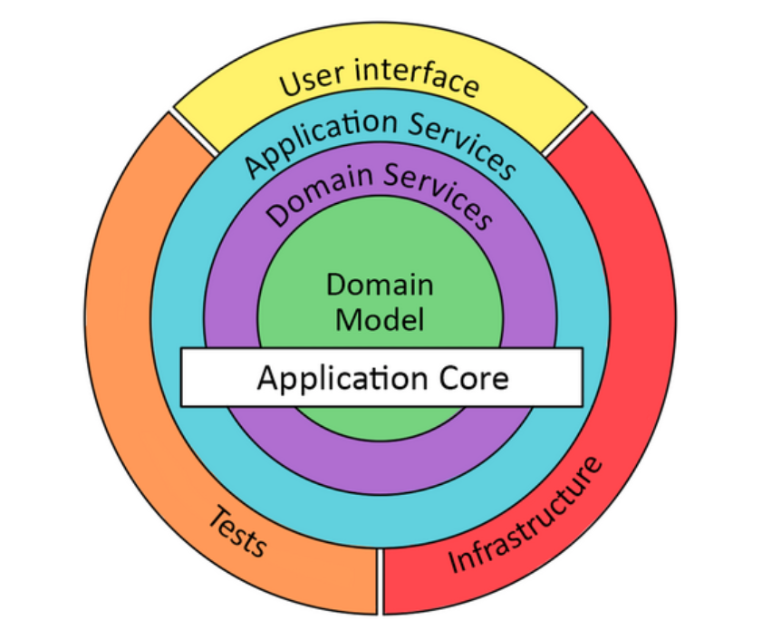

# Onion Model 

# Domain Driven Design

**DDD**A design approach that is driven by domain, not technology

**Domain**

The sphere of knowledge, in problem space

The subject area to which the system belongs to 

Core domain, supporting domain, generic domain

**Model**

Abstractions to describe the domain in solution space

**Context**

The scope in which the model is valid

**Ubiquitous Language**

A language structure around the domain model Used by the team

# DDD Patterns

**Domain Service**

Core for the given bounded context Implements Business Logic

Involves more than one domain object Not CRUD operations

**Application Services**

Entry point to access the domain layer Interface to external consumers

REST layer

**Infrastructure Services**

Generic technical services Email, Queues and etc Typically ready-made services

**Entities**

Identifiable and Mutable

Can be created with minimum requirements

**VO/Value Objects**

No identity, Immutable and interchangeable

Alternative to primitive obsession

**DTO/Data Transfer Object**

Data containers for transport across layers

Hides internal data structures

**Aggregate**

Cluster of objects with an aggregate root

**Repository**

Handles CRUD on Aggregates

Gives an impression of in-memory storage

# Strategic DDD

**Context/Bounded Context**

Packages, Namespaces, Modules Subsystems or Microservices

Specific Teams, Databases, Language

**Continous Integration**

Common code repository Frequent Builds Automated Tests

**Context Map**

Maps different bounded contexts

**Bounded Context Vs Subdomain**

Subdomain belongs to problem

Bounded Context belongs to solution

Multiple bounded-contexts within a given subdomain

**Integration**

Multiple Bounded Contexts 

Legacy Systems 

Third-party Services 

**Integration Strategies**

Shared Kernel: Shared minimal domain model 

Customer/Supplier: Aligned priorities, tasks 

Conformist: At the mercy of third-party 

Anti-Corruption Layer: Translation layer 

Open Host: Services for others to integrate 

Published Language: JSON/XML Messages 

Separate Ways: Let’s not integrate

Final solution may involve multiple strategies

# Case Study

An art shop sells various products to its customers. The art shop wants to build portal that displays the products along with price, specification and etc., The customers must register themselves through the portal, before ordering the products. The portal also should allow the registered customers to raise and track issues.

The IT team wants to go with DDD to build the portal with the following subdomains:
1. Product Catalog Service (pcs)
2. Order Service (os)
3. User Management Service (ums)
4. Customer Support Service (css)

Initially, they want to deploy the UMS and CSS with the following use cases:

User Management Service
- to register a user (phone number, name, delivery address)
- to activate/de-activate users
- to list users based on city
- to find user details based on phone number

Customer Support Service
- to raise a ticket
- to view details of a ticket
- to add comments on an active ticket
- to change status of ticket (NEW, OPEN, CLOSED, ACCEPTED)
- to list the tickets on status
- to list the tickets on user

Apart from above core sub-domains, the IT team wants to build the following generic services

Message Broker
- to subscribe
- to publish

Framework
- Response and Response Builder
- Error
- Factory
